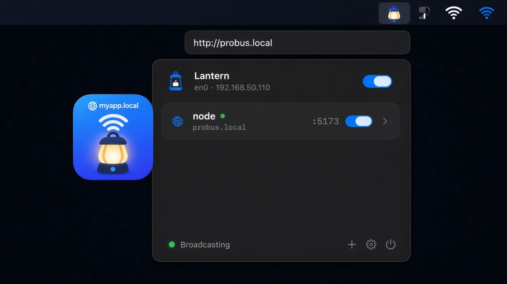

# Lantern

**Portless LAN names for local apps.**  
Menu bar app for macOS that advertises `http://name.local` on your Wi‑Fi — the missing piece when OrbStack’s `*.orb.local` only works on the host.

<p align="center">
  
</p>

<p>
  <a href="https://github.com/sinhong2011/lantern/releases/latest/download/Lantern.dmg">
    <picture>
      <source media="(prefers-color-scheme: dark)" srcset="docs/download-macos-dark.svg">
      
    </picture>
  </a>
</p>

[](https://github.com/sinhong2011/lantern/releases/latest)
[](https://github.com/sinhong2011/lantern/actions/workflows/ci.yml)
[](LICENSE)

## Why

| Without Lantern | With Lantern |
|-----------------|--------------|
| `http://192.168.x.x:5173` | `http://myapp.local` |
| OrbStack `*.orb.local` (this Mac only) | Real LAN Bonjour name |
| Every phone must remember ports | Default HTTP port via local reverse proxy |

```text
Phone  →  http://myapp.local
              ↓  mDNS (Bonjour)
         Mac LAN IP :80
              ↓  Lantern proxy (rewrites Host)
         127.0.0.1:5173  (Vite / Docker / anything)
```

No changes required in the target project — Lantern rewrites `Host` to localhost so Vite and friends accept the request.

## Features

- Menu bar only (no Dock icon)
- Pick listening ports from a live list
- Edit / remove services
- Easy LAN URLs via reverse proxy (default :8787; :80 opt-in)
- Host-header rewrite for picky dev servers
- Sparkle updates from GitHub Releases
- Loopback Control API for scripts
- Settings (General / Logs / Advanced / About)
- Access + activity log (menu row, Settings → Logs, `logs.jsonl`, Console.app)

## Install

```bash
brew install --cask sinhong2011/lantern/lantern-local
```

Or download the notarized [DMG](https://github.com/sinhong2011/lantern/releases/latest/download/Lantern.dmg). Sparkle keeps either install up to date.

`homebrew/cask` already has [GetLantern](https://lantern.io) as `lantern`, so this tap uses **`lantern-local`**. Homebrew 6 asks you to trust third-party taps on first install.

## Requirements

- **Download:** macOS 14+
- **From source:** Xcode 16+ (Swift 6) and [XcodeGen](https://github.com/yonaskolb/XcodeGen)

## Install (from source)

```bash
git clone https://github.com/sinhong2011/lantern.git
cd lantern
brew install xcodegen
make run
```

Inner loop:

```text
make run        # generate, build Debug, relaunch menu bar app
make relaunch   # reopen last build (no compile)
make open       # Xcode
make status     # Control API
```

## Updates

Lantern uses [Sparkle](https://sparkle-project.org) against GitHub Releases.

- Settings → General: automatic checks (about once a day)
- Settings → About: **Check for Updates…**
- Feed: `https://github.com/sinhong2011/lantern/releases/latest/download/appcast.xml`

Releases are cut by [release-please](https://github.com/googleapis/release-please) from [conventional commits](https://www.conventionalcommits.org) (`feat:`, `fix:`, `feat!:`). Merging the Release PR tags `vX.Y.Z`; CI then Developer ID–signs, notarizes, staples, and attaches `Lantern-vX.Y.Z.dmg` (first run; also `Lantern.dmg` for the latest-download URL), `Lantern-vX.Y.Z.zip` + `appcast.xml` (Sparkle).

Notarized CI needs these GitHub secrets (Team API key — individual keys cannot call notarytool):

| Secret | What |
|--------|------|
| `APPLE_DEVELOPER_CERTIFICATE_P12_BASE64` | `base64 -i DeveloperID.p12` |
| `APPLE_DEVELOPER_CERTIFICATE_PASSWORD` | Password for that `.p12` |
| `APPLE_TEAM_ID` | 10-character Team ID |
| `APPLE_API_KEY_ID` | App Store Connect Team Key ID |
| `APPLE_API_ISSUER` | Issuer UUID |
| `APPLE_API_KEY_P8` | Contents of `AuthKey_*.p8` (or base64 of the file) |
| `SPARKLE_ED_PRIVATE_KEY` | Already set |

Local `make run` / `make dist` stay ad-hoc and unsigned.

## Usage

1. Click the antenna icon in the menu bar  
2. Turn on the master **Broadcast** toggle  
3. **Add Service** — pick a listening port (or type one)  
4. On another device on the same Wi‑Fi, open the URL (e.g. `http://myapp.local`)

**Easy URLs** (Settings → General): share one LAN name for every app.  
True `http://name.local` needs port 80; if this Mac can’t bind it, the same name uses Lantern’s door (`:8787`) instead of each app’s port.  
Copy the LAN IP from a service row if `.local` does not resolve.

## Control API

Loopback only: `http://127.0.0.1:19247`  
Writes need `X-Lantern-Token` from `~/Library/Application Support/Lantern/control-token`.

```bash
TOKEN=$(cat "$HOME/Library/Application Support/Lantern/control-token")
curl -s http://127.0.0.1:19247/status | jq
curl -s http://127.0.0.1:19247/aliases | jq
curl -s -X POST http://127.0.0.1:19247/broadcast \
  -H "X-Lantern-Token: $TOKEN" \
  -H 'Content-Type: application/json' \
  -d '{"enabled":true}'
curl -s -X POST http://127.0.0.1:19247/aliases \
  -H "X-Lantern-Token: $TOKEN" \
  -H 'Content-Type: application/json' \
  -d '{"name":"web","localPort":8080}'
curl -s http://127.0.0.1:19247/logs | jq
curl -s -X DELETE http://127.0.0.1:19247/logs \
  -H "X-Lantern-Token: $TOKEN"
```

JSONL file: `~/Library/Application Support/Lantern/logs.jsonl`  
Console.app: filter `subsystem:app.lantern` (`proxy` or `app`).

## Architecture

```text
MenuBarExtra UI
  ├── AliasStore          persisted JSON in Application Support
  ├── BroadcastEngine     DNS-SD / dns-sd -P  → name.local → LAN IP
  ├── LocalProxy          :80/:8787  Host-based reverse proxy
  ├── PortDiscovery       lsof listening TCP ports
  ├── AccessLogStore      logs.jsonl + session ring + os.Logger
  ├── ControlServer       127.0.0.1:19247 JSON API
  └── AppUpdater          Sparkle → GitHub Releases appcast
```

## Project layout

```text
Lantern/                 Swift sources
project.yml              XcodeGen spec
scripts/build.sh         generate + xcodebuild
docs/plans/              design notes
.github/                 CI + issue templates
```

## Contributing

See [CONTRIBUTING.md](CONTRIBUTING.md).  
Security reports: [SECURITY.md](SECURITY.md).

## License

[MIT](LICENSE)
